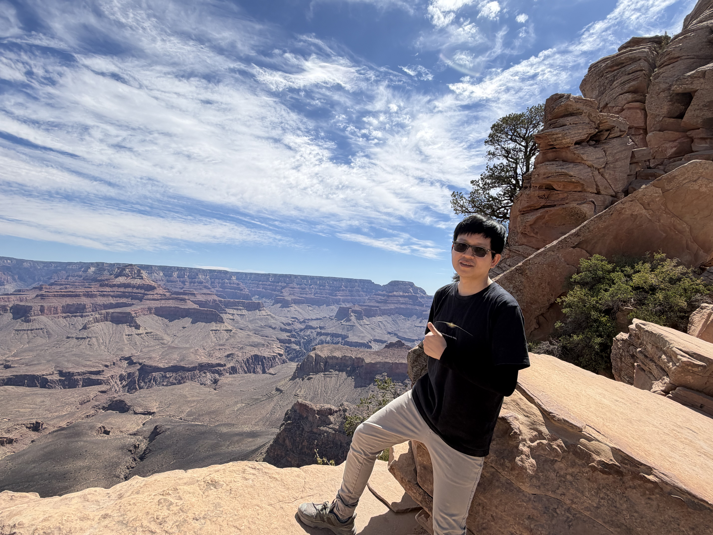

::: {.profile-grid}
::: {.profile-main}
## About me

I am an Assistant Professor of Statistics in the Department of Mathematical Sciences at the University of Texas at Dallas. I am broadly interested in foundations of AI, data science, statistics, and related fields.

Previously, I was a postdoctoral researcher at SAMSI and the Department of Statistical Science at Duke University, where I worked with [Sayan Mukherjee](https://sayanmuk.github.io/) and [Eric Laber](https://www.laber-labs.com/).

I received my PhD in Applied and Interdisciplinary Mathematics from the University of Michigan, advised by [Alfred Hero](https://hero.engin.umich.edu/) and [XuanLong Nguyen](http://dept.stat.lsa.umich.edu/~xuanlong/). I received my BS in Computational Mathematics from Nankai University.
:::

::: {.profile-side}

**Email:** [yun.wei@utdallas.edu](mailto:yun.wei@utdallas.edu) (work)  
[cloudwei@umich.edu](mailto:cloudwei@umich.edu) (permanent)
:::
:::

## Research interests

::: {.interest-grid}
::: {.interest-group}
### Theory and methods

- Latent variable models
- High-dimensional statistics
- Bayesian statistics
- Generative models
:::
:::

::: {.more-link}
[Research publications and projects →](research.qmd)
:::

::: {.split-section}
::: {.profile-column}
## Education

**PhD, Applied and Interdisciplinary Mathematics**  
University of Michigan

**BS, Computational Mathematics**  
Nankai University
:::

::: {.profile-column}
## Employment

**Assistant Professor of Statistics**  
University of Texas at Dallas

**Postdoctoral Researcher**  
SAMSI and Duke University
:::
:::

## News

- **August 2026.** [Optimal transport based theory for latent structured models](http://arxiv.org/abs/2601.11465) was accepted at *Statistical Science*.
- **August 2026.** I organized and gave a talk in the JSM 2026 session, “Novel theoretical development in mixture models and latent variable models,” in Boston, Massachusetts.
- **August 2026.** [Distributional Evaluation of Generative Models via Relative Density Ratio](https://arxiv.org/abs/2510.25507) received the STAI-X Best Abstract Award.
- **June 2026.** I gave a talk at ICSA 2026 in Arlington, Virginia.
- **May 2026.** I hosted Mengxin Wang's seminar talk at UT Dallas.